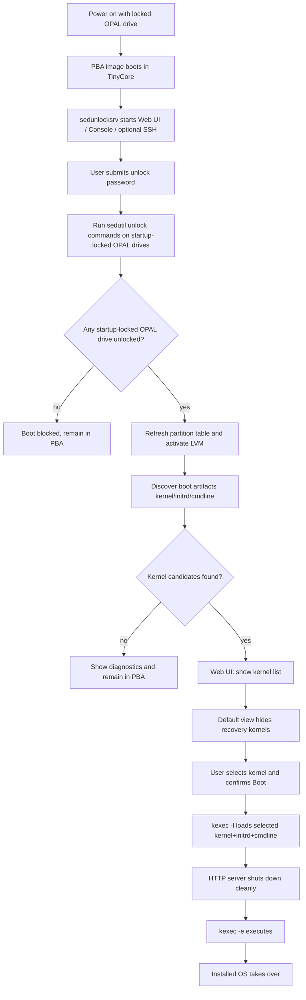

# 🚀 Enhanced TCG Opal 2.0 PBA


### ✨ Key Enhancements
*   **Integrated Go Backend**: A single, high-performance Go binary manages the **Web UI (80/443)** and **Interactive Console** simultaneously.
*   **kexec Boot**: Transitions directly into the a linux kernel after unlocking, bypassing BIOS POST for faster, more reliable "warm" boots that maintain drive authorization.
*   **LACP Networking**: Native 802.3ad (Mode 4) bonding via `sysfs` with a 30-second synchronization loop to ensure connectivity before service start.
*   **Hardened Security**: 
    *   Strict password complexity (12+ chars, Upper/Lower/Numeric/Special).
    *   HTTPS-enforced web interface with automatic Port 80 redirection.
    *   SSH management restricted via `authorized_keys` command execution.
*   **Modern Console UI**: Interactive dashboard with real-time drive status, masked password entry, and a 30-second privacy timeout.
*   **Optimized Build**: Fully automated, "no-cache" build process using TinyCore 15.x and optimized Go binaries.

---

## 📋 Deployment Workflow Reference

**New to this project?** See [DEPLOYMENT-WORKFLOW.md](DEPLOYMENT-WORKFLOW.md) for a **complete step-by-step example** of:

1. **Initial Setup** — Clone → Configure build.conf → Build initial PBA → Flash to OPAL drive
2. **Operational Setup** — Run setup-deploy.sh → Configure SSH key encryption  
3. **Automated Updates** — Deploy updated PBA with new certificates via SSH

**Deployment documentation:**
- [DEPLOYMENT-WORKFLOW.md](DEPLOYMENT-WORKFLOW.md) — Full end-to-end workflow (start here)
- [deploy/QUICKSTART.md](deploy/QUICKSTART.md) — 20-minute setup guide with troubleshooting
- [deploy/README.md](deploy/README.md) — Complete command reference for deploy.sh and setup-deploy.sh
- [deploy/CERTIFICATE-FRESHNESS.md](deploy/CERTIFICATE-FRESHNESS.md) — Race condition protection for automated cert pipelines

---

## Comparison with Original

This is a **feature-enhanced fork** of [Jip-Hop/sedunlocksrv-pba](https://github.com/Jip-Hop/sedunlocksrv-pba). All original functionality is preserved while adding useful enhancements.

### Enhanced Features (This Fork)
- ✅ **Unified Backend** — Single Go binary manages Web UI + Console + SSH (vs separate services in original)
- ✅ **Warm Boot Support** — `kexec` integration for faster, OPAL-state-preserving boots
- ✅ **Advanced Networking** — LACP 802.3ad bonding + static IP configuration (original: DHCP only)
- ✅ **Security Hardening** — Password complexity rules, HTTPS enforcement, token-gating, expert mode isolation
- ✅ **Enhanced Boot Discovery** — Pattern matching for non-standard kernel naming
- ✅ **Better Reliability** — Console fallback if networking fails, drive diagnostics, real-time status display
- ✅ **Configuration Flexibility** — GRUB variable expansion, line continuation handling, multiple boot loader support
- ✅ **Automated Deployment** — `deploy/deploy.sh` automates PBA build + flash over SSH; OPAL password derived from an Ed25519 signing key, independent of the PBA-side SSH unlock key
- ✅ **Certificate Freshness Validation** — `deploy/deploy.sh` rejects deployments when the TLS certificate is too close to expiry, preventing stale-cert races in automated pipelines
- ✅ **Full Lifecycle Scripting** — `setup-deploy.sh` one-time setup; then cron or CI runs `deploy.sh` to rebuild and reflash PBA automatically

### Original Features (Maintained)
- ✅ Unlock via HTTPS web interface
- ✅ Unlock via SSH (with command restrictions)
- ✅ Keyboard unlock at console
- ✅ Password changes from web UI
- ✅ Multiple keyboard mapping support
- ✅ BIOS + UEFI boot support
- ✅ Reboot functionality

---

## What's New in Detail

**Network Configuration**: Original build only supports DHCP and interface exclusion. This fork adds:
   - Static IP configuration: `--net-addressing=static --ip-addr=... --netmask=...`
   - Linux LACP bonding: `--net-mode=bond --net-ifaces="eth0 eth1"` with 802.3ad mode
   - DHCP still works as before with no configuration needed

**Boot Process**: Original supports BIOS/UEFI boot. This fork adds:
   - `kexec` warm handoff for faster boots (use `Boot` button)
   - Traditional firmware reset still available (`Reboot` button)
   - Automatic fallback if boot discovery fails

**Security**: Beyond original SSH command restrictions, this fork adds:
   - **Expert Mode**: Separate password-protected access to advanced administrative functions 
   - **Expert Re-flash Flow**: Advanced tab can upload a new PBA image and run `sedutil-cli --loadpbaimage` against a selected drive
   - Password complexity enforcement for unlock password changes (12+ chars, Upper/Lower/Numeric/Special by default; configurable)
   - HTTPS-enforced web interface (HTTP auto-redirects to HTTPS)
   - Token-based protection for `boot` and password change operations

**Password Configuration**:
   
   *Expert Password (Web UI Expert Tab):* 
   - Provides access to advanced operations (Revert TPer, PSID Revert, Flash PBA)
   - Password is set once at build time, not changed by end users
   - If not provided via `--expert-password=VALUE` or `build.conf`, you will be prompted to enter and confirm a password during build
   - No complexity requirements — user can use any characters (spaces, symbols, etc.)
   - Build prints a confirmation message when set via prompt
   
   *Unlock Password Complexity (for password changes):*
   - Controls requirements when users change unlock passwords from web UI or console
   - Configurable at build time with flags (default: 12+ chars with uppercase, lowercase, digits, special chars)
   - Build flags:
     - `--password-complexity=on|off` — Master switch (default: on)
     - `--min-password-length=N` — Minimum chars (default: 12)
     - `--require-upper=true|false` — Uppercase A-Z (default: true)
     - `--require-lower=true|false` — Lowercase a-z (default: true)
     - `--require-number=true|false` — Digits 0-9 (default: true)
     - `--require-special=true|false` — Special chars (default: true)
   - Can also be set in `build.conf` under the "Password Policy" section
   - Requirements are displayed in console TUI (`P` menu) and web API (`/password-policy` endpoint)

   **Build Examples:**
   ```bash
   # Expert password via prompt (if not in build.conf)
   ./build.sh                                        # You will be prompted for expert password
   
   # Expert password via CLI (bypasses prompt)
   ./build.sh --expert-password='MySecret!'
   
   # Complexity: no requirements
   ./build.sh --password-complexity=off
   
   # Complexity: strict length only
   ./build.sh --min-password-length=20 --require-upper=false --require-lower=false --require-number=false --require-special=false
   
   # Complexity: default (12+ chars, all types)
   ./build.sh
   ```

**Boot Discovery**:
   - GRUB configuration parsing with variable expansion
   - GRUB line continuation handling
   - `systemd-boot` partition detection
   - Support for LVM, LUKS, and split `/boot` layouts

---

## Quick Start
1. Build host prep (Debian/Ubuntu): install dependencies, then run `sudo ./build.sh`.
2. Optional build config: copy `build.conf.example` to `build.conf` and set values for:
   - Network mode, TLS cert/key, expert password, password complexity settings
   - Or pass as CLI flags instead
3. Build image: `sudo ./build.sh --ssh` (with SSH UI) or `sudo ./build.sh` (web + console only)
   - If expert password not in build.conf/CLI, you will be prompted to enter it
   - Example with custom settings: `sudo ./build.sh --expert-password='PASS' --password-complexity=off`
4. Flash and load PBA with `sedutil-cli --loadpbaimage ...`, see original fork for great details
5. Boot target machine into PBA and unlock drives from:
   - Web UI: `https://<pba-ip>/`
   - SSH UI (optional): `ssh -p 2222 tc@<pba-ip>`
   - Local console keyboard on the machine
6. After unlock:
   - Use `Boot` for fast warm handoff via `kexec`
   - Use `Reboot` for a full hardware/firmware restart path

## Boot Flow (Locked OPAL -> kexec)



## Versioning and Snapshot Releases (No Binary Upload)
- You can publish a versioned release as a source-code snapshot only (for example `v1.0.0`) without compiling or uploading a `.img` binary.
- This repository includes a GitHub Actions workflow at `.github/workflows/release.yml` that creates a GitHub Release when you push a `v*` tag.
- Version numbers are manual and intentional: tag only when features are implemented, tested, and ready for general consumption.

Example flow:
```bash
git tag v1.0.0
git push origin v1.0.0
```

Notes:
- GitHub automatically provides source archives (`.zip` and `.tar.gz`) for tagged releases.
- Commits between tags do not need a new version number.
- `REPO_URL` is auto-detected from `remote.origin.url` during build when not explicitly set.
- To override detection, set `REPO_URL="https://github.com/<owner>/<repo>"` in `build.conf` or pass `--repo-url=...` to `build.sh`.
- To confirm the current commit is exactly on a version tag before building, run:
   ```bash
   git tag --points-at HEAD
   ```
   If this prints `v1.0.0` (or another version tag), `./build.sh` will use that tag as the build version.

## Security Notes & Known Limitations

- **Unauthenticated `/reboot` and `/poweroff` endpoints**: These endpoints are intentionally unauthenticated. In the PBA context there is no acceptable way to supply a session token for power operations — the user may need to reboot or power off without having unlocked any drives. This is by design.
- **Passwords visible in `/proc/cmdline`**: Disk passwords are passed as command-line arguments to `sedutil-cli` and are therefore visible in `/proc/<pid>/cmdline` while the process runs. This is a limitation of `sedutil-cli` itself and cannot be mitigated without upstream changes. The PBA environment is a single-user, ephemeral boot image where only the operator has access.
- **Single active session**: Only one web session token exists at a time. A new login invalidates the previous session. This is by design: the PBA is a single-user environment and does not need concurrent session support.
- **Docker build path**: The `Dockerfile` is provided for convenience but has not been tested with the current version of this fork. Use the native build host path (`sudo ./build.sh`) for production images.

---

## Operational Notes
- `Boot` is a warm handoff through `kexec`. This is faster and keeps unlocked OPAL state, but it is not the same as a cold restart. If the target OS or platform firmware only behaves correctly after a full restart, use `Reboot` instead.
- Split boot layouts are supported. A working system may store EFI bootloader files on one partition and the actual kernel/initrd on another filesystem such as LVM-backed root or `/boot`.
- **Recovery Kernels in Web UI**: Kernel discovery may include normal and recovery boot entries. Recovery kernels are hidden by default in the web flow (`Hide Recovery Kernels` checked). Users can uncheck the option to show them, and recovery entries are labeled with a `[Recovery]` prefix.
- **Expert Mode Access**: The web UI Expert tab requires the password set at build time. This is not the unlock password, nor is it changed by end users. If a new Expert Mode password is needed, the build must be redone with a new password.
- **Expert Re-flash PBA**: In the Expert tab you can upload a replacement `.img` file and re-flash PBA on a target drive. You must provide the current drive password, target `/dev/...` path, and type `FLASH` to confirm. The web UI performs preflight checks and rejects files above 128 MiB, matching the project's OPAL2 PBA size guideline. The server also validates that the uploaded image matches the build's expected disk layout: DOS MBR, one bootable `0xEF` partition from the `sfdisk` recipe, and a readable FAT32 boot partition created by `mkfs.fat -F32`. The Expert output panel shows the validation summary so you can see exactly what passed before the flash runs. Use with care: selecting the wrong target can break boot access for that device.
- **Expert Revert TPer**: This operation attempts to revert the TPer (Trusted Peripheral) to factory state using the current drive password. This is a destructive operation that can invalidate existing unlock configuration and ownership metadata. Use this only when standard unlock paths fail or when you need to completely reset the drive's security configuration. You must provide the target device path, current drive password, and type `REVERT` to confirm. The Expert output panel shows the sedutil output for diagnostic purposes.
- **Expert PSID Revert**: This is a last-resort factory reset using the Physical Security ID (PSID) printed on the drive's label. This operation **completely erases access to all existing encrypted data** and resets the drive to its original factory state. Only use this when no other recovery method is available and you accept data loss. You must provide the target device path, the PSID value from the drive's label, and type `ERASE` to confirm. The Expert output panel shows the sedutil output.
- **Unlock Password Changes**: When users change unlock passwords (pressing `P` in console or using web UI password change):
  - The complexity requirements set at build time are enforced (see "Password Configuration" above)
  - Requirements are displayed before the user enters the new password
  - Password change is intentionally target-based: select which drive(s) to update
  - In console UI, enter the exact target device path when prompted
- SID password changes can be blocked by firmware. On systems with a BIOS or TPM setting such as `Disable Block SID`, that setting may need to be `Disabled`, and some platforms require a one-time confirmation on the next boot before SID changes are allowed.
- SSH host fingerprints are expected to remain stable across reboots and rebuilds as long as the Dropbear host keys in `ssh/` are preserved. If you delete and regenerate those files, the fingerprint will change once for the newly built image.

- If `Boot` cannot find a kernel or initrd, inspect whether your system uses a split EFI plus LVM `/boot` or root layout. This project is designed to search those layouts, but real-world GRUB arrangements vary.
- If password change reports that `Admin1` updated but `SID` did not, the drive may still unlock with the new password while firmware is blocking SID changes. Check Block SID settings before assuming the whole password update failed.

- Test both `Boot` and `Reboot` on your actual hardware. Some systems behave well with `kexec`, while others still need a full firmware restart for NICs, storage, or other platform state.

---

## 🛠️ Build Host Dependencies
Use a Debian/Ubuntu/Proxmox build host.

```bash
sudo apt update && sudo apt install -y \
  build-essential \
  coreutils \
  findutils \
  util-linux \
  mount \
  fdisk \
  dosfstools \
  cpio \
  xz-utils \
  gzip \
  rsync \
  libarchive-tools \
  grub-common \
  grub-pc-bin \
  grub-efi-amd64-bin \
  grub-efi-ia32-bin \
  xorriso \
  curl \
  git \
  openssl \
  jq \
  openssh-client \
  file \
  unzip
```

`build.sh` verifies all required commands at startup and lists anything missing. If you build with `--ssh`, also install `dropbear-bin`:

```bash
sudo apt install -y dropbear-bin
```

## 🐹 Go Installation (Required)
The Go backend requires a modern toolchain — **do not use the `golang-go` distro package**, it is too old.

1. Remove distro Go packages if needed:
```bash
sudo apt remove golang-go && sudo apt autoremove
```


2. Install official Go (example: 1.26.1):
```bash
curl -OL https://go.dev/dl/go1.26.1.linux-amd64.tar.gz
sudo rm -rf /usr/local/go
sudo tar -C /usr/local -xzf go1.26.1.linux-amd64.tar.gz
rm go1.26.1.linux-amd64.tar.gz
```

3. Ensure Go is in `PATH`:
```bash
echo 'export PATH=$PATH:/usr/local/go/bin' >> ~/.bashrc
source ~/.bashrc
```

## 📋 Pre-Build Checklist
Before running `./build.sh`, verify:
- `sedunlocksrv/server.crt` and `sedunlocksrv/server.key` exist if you are supplying custom TLS certs.
- `ssh/authorized_keys` exists if you plan to build with `--ssh`.
  > **Note:** The public keys in `ssh/authorized_keys` grant access to the **PBA's Dropbear SSH service** (port 2222) for drive unlocking at boot time. This is completely independent of the Ed25519 key used by `deploy/deploy.sh` for OPAL password KDF decryption — they are separate keys for separate purposes and do not need to be the same key.
- Expert password plan is set: either pass `--expert-password=...` or set `EXPERT_PASSWORD` in `build.conf`. If omitted, `build.sh` prompts you to enter and confirm one interactively.

## 🚀 Build Execution
```bash
chmod +x build.sh
sudo ./build.sh
```

## Build Configuration (`build.conf`)
Defaults live in `build.sh`. To use your own defaults:

1. Copy `build.conf.example` to `build.conf` (same directory as `build.sh`).
2. Uncomment and edit variables as needed (`build.conf` is a sourced Bash snippet).
3. CLI flags override file values.

Resolution order:
**built-in defaults → `build.conf` (or `BUILD_CONFIG`) → `--config=FILE` → remaining CLI flags**

Useful flags:
- `--clean`: remove build artifacts and cache before building.
- `--ssh`: include SSH unlock interface (`dropbear`) in the image.
- `--keymap=NAME`: set Tiny Core console keymap (for example `fr-latin9`).
- `--bootargs=...`: set kernel command line for the PBA boot entry.
- `--exclude-netdev=...`: exclude interfaces from runtime network setup.
- `--net-mode=single|bond`: choose single-interface mode or Linux bonding mode.
- `--net-ifaces="eth0 eth1"`: explicit interface list to manage; empty means autodetect.
- `--net-addressing=dhcp|static`: choose DHCP or static IPv4 runtime addressing.
- `--ip-addr=...`: static IPv4 address when static mode is selected.
- `--netmask=...`: static netmask when static mode is selected.
- `--gateway=...`: default gateway for static mode.
- `--dns="..."`: DNS server list (space-separated).
- `--bond-mode=4`: Linux bonding mode value (default `4` / 802.3ad).
- `--bond-miimon=100`: bond link monitor interval in milliseconds.
- `--bond-lacp-rate=1`: LACP rate (`1` is fast).
- `--bond-xmit-hash-policy=1`: bond transmit hash policy value.
- `--tls-cert=/path/to/server.crt`: use custom TLS certificate.
- `--tls-key=/path/to/server.key`: use custom TLS private key.
- `--ssh-curl-insecure=auto|true|false`: control whether SSH helper uses `curl -k`.
- `--debug-level=0|1|2`: runtime log verbosity (`0` verbose trace, `1` normal progress, `2` quiet).
- `--expert-password=...`: set expert password input at build; runtime stores only hash.
- `--sedutil-fork=ChubbyAnt`: switch sedutil source fork (`Drive-Trust-Alliance` default).
- `--config=/path/to/file`: load build variables from an alternate config file.

When building with `--ssh`, the generated Dropbear host keys are kept in the repository `ssh/` folder and reused in later builds. Keep those files if you want a stable SSH host fingerprint over time.

---

## Boot Discovery

The PBA automatically discovers your installed operating system's kernel and initrd files to boot after unlock. This works on all systems, including:
- **Linux distributions**: Ubuntu, Debian, CentOS, Rocky, AlmaLinux, Fedora, openSUSE, NixOS, Arch, and others
- **systemd-boot**: Detects `.conf` entries in EFI partition
- **GRUB**: Parses GRUB configuration and expands variables
- **Custom kernels**: Non-standard names (`kernel`, `bzImage`, custom naming schemes) are detected via binary inspection
- **Split layouts**: Supports separate EFI and `/boot` partitions, LVM-backed root, and complex arrangements

Boot discovery uses:
1. **Filename pattern matching** — for standard kernel names (`vmlinuz*`, `initrd*`, `bzImage`, etc.). The source code contains notes for adding a pattern if you use a non-standard or custom name.

---

## 📂 Source Code Structure

The Go backend (`sedunlocksrv/`) is organized into focused modules:

| File | Purpose |
|------|------|
| `main.go` | HTTP server setup, all endpoint handlers, boot logic (kernel discovery, kexec), unlock/password flows, console TUI, session management, PBA image validation |
| `types.go` | All shared data structures (`StatusResponse`, `DriveStatus`, `BootResult`, `BootKernelInfo`, `PasswordPolicy`, etc.) — doubles as API contract documentation |
| `drive.go` | OPAL drive detection (`scanDrives`), diagnostics (`collectDriveDiagnostics`), partition enumeration, block device rescanning |
| `network.go` | Network interface discovery — addresses, carrier state, interface names |
| `ssh.go` | Dropbear SSH service detection and startup on port 2222 |
| `util.go` | HTTP helpers (`jsonResponse`, `requireMethod`), `sedutil-cli` wrappers (`runSedutil`, `queryDrive`, `queryField`), file lookup, expert command execution |
| `cmd/hash-password/main.go` | Standalone CLI tool — hashes a password with bcrypt for `build.conf` or `--expert-password` use |

Supporting files:

| File | Purpose |
|------|------|
| `build.sh` | Automated PBA image builder — downloads TinyCore, compiles Go binary, assembles BIOS+UEFI bootable disk image |
| `ssh/ssh_sed_unlock.sh` | SSH forced-command menu — unlock drives, change passwords, reboot/boot/poweroff from an SSH session |
| `index.html` | Single-page web UI — Unlock, Password Change, Diagnostics, and Expert tabs with token-gated operations |
| `tc/tc-config` | TinyCore boot init — network setup (DHCP, static, LACP bond), kernel module loading, service startup |
| `make-cert.sh` | Generates self-signed TLS certificate and key for the HTTPS server |

## 🌐 API Endpoints

The Go backend exposes the following HTTP endpoints on ports 80 (redirect) and 443 (HTTPS):

| Endpoint | Method | Auth | Description |
|----------|--------|------|-------------|
| `/` | GET | — | Serves the web UI (`index.html`) |
| `/status` | GET | — | Drive lock status and network info (JSON) |
| `/diagnostics` | GET | — | Detailed TCG query data for all drives (JSON) |
| `/password-policy` | GET | — | Current password complexity requirements (JSON) |
| `/unlock` | POST | — | Submit unlock password for startup-locked drives |
| `/change-password` | POST | Token | Change Admin1/SID password on selected drives |
| `/boot-list` | GET | Token | List discovered kernel/initrd boot candidates (JSON) |
| `/boot` | POST | Token | Load and execute a selected kernel via kexec |
| `/boot-status` | GET | — | Current boot launch state (JSON) |
| `/reboot` | POST | — | Immediate hardware reboot (`reboot -nf`) |
| `/poweroff` | POST | — | Immediate power off (`poweroff -nf`) |
| `/expert/auth` | POST | — | Authenticate with expert password, receive expert token |
| `/expert/status` | GET | Expert | Flash operation progress (JSON) |
| `/expert/revert-tper` | POST | Expert | Factory-reset drive TPer with current password |
| `/expert/psid-revert` | POST | Expert | PSID factory reset (erases all data) |
| `/expert/check-ram` | POST | Expert | Verify sufficient RAM for PBA flash upload |
| `/expert/reflash-pba` | POST | Expert | Upload and flash a replacement PBA image |
| `/expert/flash-status` | GET | Expert | Detailed flash validation and progress (JSON) |

**Auth legend:** "—" = unauthenticated, "Token" = session token from successful unlock, "Expert" = expert token from `/expert/auth`.

---

## Historical Upstream README (Unmaintained)
The content below this line is copied from the original upstream project for historical reference only.
It is not maintained as part of this fork's active documentation.

---

# sedunlocksrv-pba
Conveniently unlock your Self Encrypting Drive on startup (via HTTPS or SSH) without the need to attach monitor and keyboard.


## Disclaimer
Use at your own risk! You may lock yourself out of the data on the disk.

## Compatibility
This tool, `sedunlocksrv-pba`, will only work if you have a Self Encrypting Drive (SED) which is compatible with [sedutil](https://github.com/Drive-Trust-Alliance/sedutil) (TCG OPAL). For example the Samsung EVO 850 SSD.

## Use case
Fully encrypt your home server or NAS and conveniently unlock it on startup without the need to attach monitor and keyboard. Unlocking can be done from any device on your LAN with a browser. By default a self-signed HTTPS certificate is used (generated during building) to secure the unlocking.

Because the drive is using hardware encryption, you can encrypt your server if the OS doesn't support encryption at all, or only for some disks (e.g. no encryption for the drive on which the OS is installed).

Even for systems which support encrypting all drives, using a SED with `sedunlocksrv-pba` can be useful because of the remote unlock functionality. Unlock and continue booting from any device on your LAN via HTTPS/SSH. If you're using a password manager you can conveniently auto-fill the unlock password.

## Features
- Unlock your SED from a browser (via HTTPS)
- Unlock your SED via SSH
- Change disk password from a browser (via HTTPS)
- Not limited to us_english keyboard mapping
- Reboot button to boot from the unlocked drive
- BIOS and UEFI support
- Configuring specific keymaps on the console

## SED benefits
- Encrypt your (boot) drive, even when the OS doesn't (fully) support encryption
- Drive locks when power is lost, protecting data when server is stolen 
- Hardware encryption means less CPU usage 

## Requirements
- A Self Encrypting Drive compatible with [sedutil](https://github.com/Drive-Trust-Alliance/sedutil) (TCG OPAL)
- Ubuntu to build the PBA image
- Two USB sticks to flash the PBA image

## Building with Docker

This allows building the image with Docker, even on Apple Silicon (arm64) using [Rosetta for Linux](https://www.docker.com/blog/docker-desktop-4-25/) in Docker Desktop v4.25 and up.

```bash
(NAME=sedunlocksrv-pba; docker build -t $NAME . && docker run --name $NAME --privileged $NAME && docker cp $NAME:/tmp/sedunlocksrv-pba.img sedunlocksrv-pba.img; docker rm $NAME)
```

After running the command above you will find sedunlocksrv-pba.img in your current working directory. Continue with [Encrypting your drive and flashing the PBA](#encrypting-your-drive-and-flashing-the-pba).

## Setup a VM for building with VirtualBox
- Download and install [VirtualBox](https://www.virtualbox.org/wiki/Downloads)
- Also install the VirtualBox Extension Pack from the link above
- [Download Ubuntu 22.04](https://sourceforge.net/projects/linuxvmimages/files/VirtualBox/U/22.04/Ubuntu_22.04_VB.7z/download) from [linuxvmimages](https://www.linuxvmimages.com/images/ubuntu-2204/)
- Extract the downloaded archive
- Import the VM by double clicking the extracted `.ova` file
- Open Settings for the newly created VM and go to Ports->USB to enable the USB 3.0 (xHCI) Controller
- Boot the VM and login with username `ubuntu` and password `ubuntu`
- Tip: enable Shared Clipboard from the Devices dropdown menu to copy and paste the commands in the next steps
- Optional: open Terminal and run `sudo apt-get -y install nautilus-admin && sudo adduser $USER vboxsf` for convenience (access VirtualBox shared folders and browse in Files as admin via right click -> Open as Administrator)
- Insert the `Guest Additions CD image` from the `Devices` menu dropdown, update the installation and reboot
- Open Terminal and become root with: `sudo su`
- Update with: `apt-get update && apt-get -y upgrade`
- Continue with building in the next steps

## Building on Ubuntu 22.04 LTS
- Install build dependencies: `apt-get -y install build-essential cpio curl dosfstools dropbear-bin fdisk git grub-efi-amd64-bin grub-efi-ia32-bin grub-pc-bin grub2-common libarchive-tools rsync xorriso xz-utils jq openssh-client file unzip openssl` (Go must be installed separately from [go.dev/dl](https://go.dev/dl))
- [Download](https://github.com/Jip-Hop/sedunlocksrv-pba/archive/refs/heads/main.zip) or clone this repo and run: `./build.sh`
- Connect your USB stick to Ubuntu (if inside VirtualBox, use the Devices dropdown menu)
- Format the stick with a supported filesystem (e.g. FAT32) if this is not already the case
- Copy the `sedunlocksrv-pba.img` file onto your USB stick (use the GUI file explorer or `cp` from the Terminal)
- Eject the USB stick and put it aside for now
- Use the other USB stick for the sedutil rescue system (see next step)

## Testing PBA with qemu

```
qemu-system-x86_64 -drive format=raw,file=sedunlocksrv-pba.img -netdev user,id=net0,hostfwd=tcp::8443-:443 -device virtio-net-pci,netdev=net0
```

## SED unlock with keyboard

Note that you can still unlock SED disks using the keyboard with this PBA image. Just key in your password and press Enter when the prompt "Key in SED password and press Enter anytime to unlock" appears. Note that keystrokes won't be echoed on the screen. Repeat for other disks (if all disks have the same password they will be unlocked in one step). After the disks are successfully unlocked, reboot by pressing ESC.

## Configuring specific keymaps on the console

To use specific keymaps, build with the KEYMAP environment variable set. For example: `KEYMAP=fr-latin9`.

## Using other forks of `sedutil`

Optionally you can use other `sedutil` forks of the [official Drive-Trust-Alliance one](https://github.com/Drive-Trust-Alliance/sedutil) by setting the environment variable `SEDUTIL_FORK` as follows:

- `ChubbyAnt`: [Fork by ChubbyAnt](https://github.com/ChubbyAnt/sedutil)

Example: `sudo SEDUTIL_FORK="ChubbyAnt" ./build.sh`

## Optional SED unlock via SSH


Optionally SED disks can be unlocked via SSH. To enable this feature (in addition to HTTPS unlocking) follow above build steps with small extras:

- install dropbear (it will be used to generate dropbear host keys):`apt-get -y install dropbear`
- create authorized_keys file in `sedunlocksrv-pba/ssh` folder. It should contain public keys of all key pairs allowed to connect to unlocking service. Have a look at provided `sedunlocksrv-pba/ssh/authorized_keys.example`
- run build with SSH option: `./build.sh SSH`

Usage:
run `ssh -p 2222 tc@IP` --> enter SED disk password --> repeat for other disks (if all disks have the same password they will be unlocked in one step) --> press ESC to reboot.

It uses port `2222` to avoid certificates' conflicts with booted computer and `tc` default Tiny Core Linux user. As long as you prefix every key in authorized_keys with the 'command=...' prefix like in the example, it will only allow SED unlocking, with any other SSH services disabled.

## Excluding network device(s)

Note that by default, the PBA image will try to configure all network devices with dynamic IP addresses using DHCP, and the web server and SSH server will listen on all interfaces. That may not be desirable in some cases (e.g. if some network device(s) is/are exposed to the Internet).

To solve this problem, optionally it is possible to set a list of network devices to be excluded when running the build script, for example:
```
sudo EXCLUDE_NETDEV="eth0 eth1" ./build.sh
```
will exclude `eth0` and `eth1` from DHCP configuration.

## Encrypting your drive and flashing the PBA
Follow [the instructions](https://github.com/Drive-Trust-Alliance/sedutil/wiki/Encrypting-your-drive) from the official Drive Trust Alliance sedutil wiki page. Except when you arrive at step `Enable locking and the PBA`, don't `gunzip` and flash the included `/usr/sedutil/UEFI64-n.nn.img` file. This is where you connect the USB stick with the `sedunlocksrv-pba.img`. Check the output of `fdisk -l` to see to which device this USB stick is mapped. In my case it's `/dev/sdg1`. Mount the USB with `mount /dev/sdg1 /mnt/`. Now flash the custom PBA with `sedutil-cli --loadpbaimage debug /mnt/sedunlocksrv-pba.img /dev/sdc`. Make sure to replace `/dev/sdc` so it targets your SED. Additionally I recommend that you set a simple password when arriving at the `Set a real password` step. For example use `test`. Set your real password through the web interface when booting from sedunlocksrv-pba.

## Tips
- Flash the PBA to all the Self Encrypting Drives in your server
- Use the same password for all the SEDs in your server (otherwise you need to enter multiple passwords during startup)
- Replace the `server.crt` and `server.key` (found inside the sedunlocksrv after running `./build.sh`) if you like, or modify `make-cert.sh` and run `./build.sh` again

## Troubleshooting
To gain shell access to the PBA for debugging, enable SSH and add an SSH key _without_ the 'command=...' prefix to ssh/authorized_keys.  This key can then be used with ```ssh -F /dev/null -o IdentitiesOnly=yes -i /path/to/debug_key -p 2222 tc@IP``` to gain a shell in the live PBA, which can then be used for viewing debug information, testing fixes, etc.

## Wishlist
- Faster booting after unlock, similar to [opal-kexec-pba](https://github.com/jnohlgard/opal-kexec-pba)
- PBA flashing via the web interface

Check out the fork in [PR #39](https://github.com/Jip-Hop/sedunlocksrv-pba/pull/39) which implements these features (and more). NOTE: this fork has not been tested by the author of sedunlocksrv-pba.

## References
- [Into the Core](http://www.tinycorelinux.net/corebook.pdf) to understand the Tiny Core Linux boot process
- Build script based on [custom-tinycore.sh](https://gist.github.com/dankrause/2a9ed5ed30fa7f9aaaa2)
- SED unlock code borrowed from [opal-functions.sh](https://github.com/rear/rear/blob/6a3d0b4d5e73c69a62ce0bd209b2b38ffb462569/usr/share/rear/lib/opal-functions.sh) and [unlock-opal-disks](https://github.com/rear/rear/blob/6a3d0b4d5e73c69a62ce0bd209b2b38ffb462569/usr/share/rear/skel/default/etc/scripts/unlock-opal-disks)
- [Example to handle GET and POST request in Golang](https://www.golangprograms.com/example-to-handle-get-and-post-request-in-golang.html)
- [How to redirect HTTP to HTTPS with a golang webserver](https://gist.github.com/d-schmidt/587ceec34ce1334a5e60)
- [How do I get the local IP address in Go?](https://stackoverflow.com/a/37382208/)
- [Simple login form example](https://www.w3schools.com/howto/howto_css_login_form.asp)
- [Fix to get the 64-bit binaries working](http://forum.tinycorelinux.net/index.php?topic=19607.0)
- Guides on installing GRUB: [grub2-bios-uefi-usb](https://github.com/ndeineko/grub2-bios-uefi-usb) and [grub_hybrid](https://www.normalesup.org/~george/comp/live_iso_usb/grub_hybrid.html)

## Featured in
- [Home Lab SSD Encryption](https://watsonbox.github.io/posts/2024/02/19/home-lab-ssd-encryption.html) by [watsonbox](https://github.com/watsonbox)

